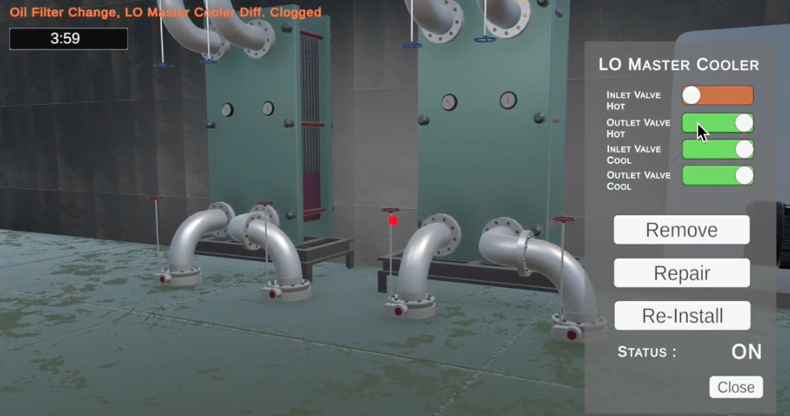

# UMTMS

UMTMS is an Erasmus+ project aiming at creating a training simulation in the field of ship machinery for maritime sector / ship machinery field students.

#Unity #Blander #Erasmus

### The consortium is made up of:

1. Gölcük Şehit Volkan Tantürk Mesleki ve Teknik Anadolu
Lisesi (TR)
2. Nikola Vaptsarov Naval Academy (BG)
3. Sea Teach,SL (ES)
4. LudusXR Aps (DK)
5. SVEUCILISTE U RIJECI (HR)
6. Second Epal Neas Ionias Volou (EL)
7. Limon Teknoloji Yazılım ve Donanım Tic.Ltd.Şti. (TR)

[Videos of game](https://drive.google.com/drive/folders/1ohYW1FHVgu-PxRpwwRsdQKmt8ZA0Oknf?usp=drive_link)

[Dashboard](http://192.168.1.137:8181/)

[Linkedin](https://www.linkedin.com/company/umtms-project/about/)

[Instagram](https://www.instagram.com/umtms.project/)

[Web](https://www.umtms.com/)

